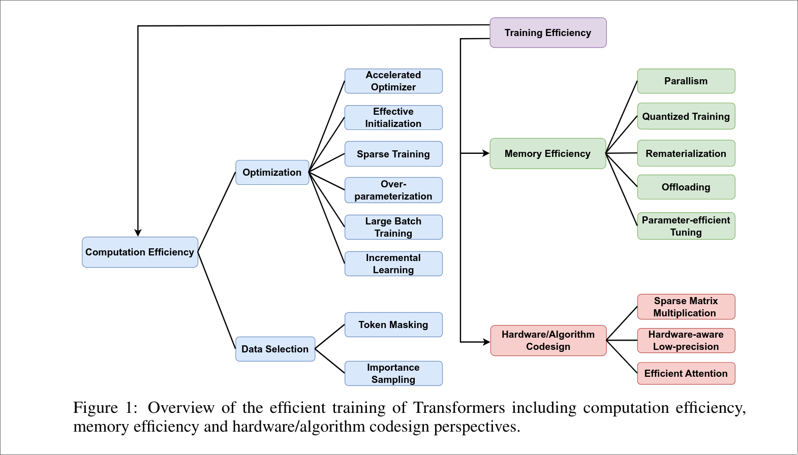
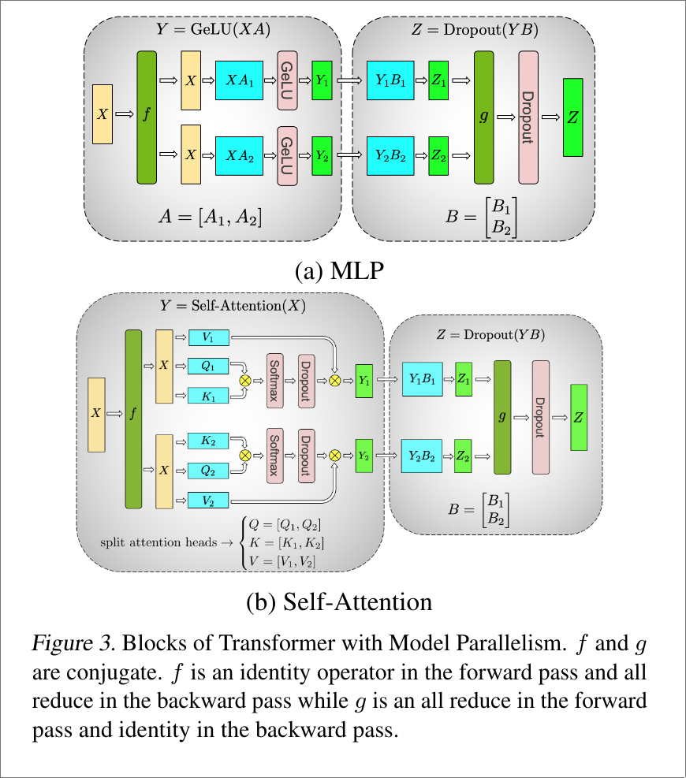
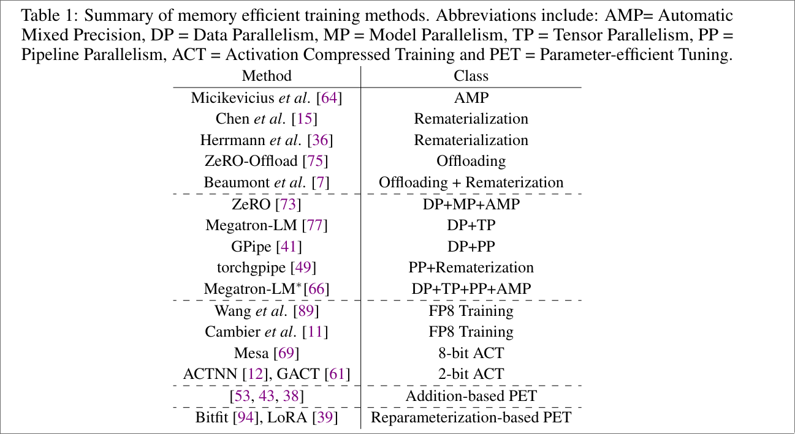

# Overview of LLM Training

Main references:

[A Survey on Efficient Training of Transformers](https://arxiv.org/abs/2302.01107) IJCAI'23

[Systems for Parallel and Distributed Large-Model Deep Learning Training](https://arxiv.org/abs/2301.02691)

\* [Efficient Training of Large Language Models on Distributed Infrastructures: A Survey](https://arxiv.org/abs/2407.20018)

( Latest )

## Computation

## Memory Efficiency

Analysis: 

[Low-Memory Neural Network Training: A Technical Report](https://arxiv.org/abs/1904.10631)

### Parallelism

[PyTorch Distributed Overview — PyTorch Tutorials 2.4.0+cu121 documentation](https://pytorch.org/tutorials/beginner/dist_overview.html)

PyTorch distributed system overview.

[Efficient Training on Multiple GPUs](https://huggingface.co/docs/transformers/perf_train_gpu_many)

Huggingface's transformers multi-GPUs training guide.

#### Data Parallelism

##### Simplest Data Parallel

[DataParallel — PyTorch master documentation](https://pytorch.org/docs/master/generated/torch.nn.DataParallel.html)

###### Parameter Sharing

[ALBERT: A Lite BERT for Self-supervised Learning of Language Representations](https://www.arxiv.org/abs/1909.11942) ICLR'20

##### Distributed Data Parallel

[DistributedDataParallel — PyTorch master documentation](https://pytorch.org/docs/master/generated/torch.nn.parallel.DistributedDataParallel.html)

[PyTorch Distributed: Experiences on Accelerating Data Parallel Training](https://arxiv.org/abs/2006.15704)

[Getting Started with Distributed Data Parallel — PyTorch Tutorials 2.4.0+cu121 documentation](https://pytorch.org/tutorials/intermediate/ddp_tutorial.html)

[Distributed Data Parallel — PyTorch 2.4 documentation](https://pytorch.org/docs/stable/notes/ddp.html)

##### Fully Sharded Data Parallel

[PyTorch FSDP: Experiences on Scaling Fully Sharded Data Parallel](https://arxiv.org/abs/2304.11277)

##### ZeRO

[ZeRO: Memory Optimizations Toward Training Trillion Parameter Models](https://arxiv.org/abs/1910.02054) SC'20

###### ZeRO-1

###### ZeRO-2

###### ZeRO-3

Basic ZeRO.

#### Model Parallelism

[Megatron-LM: Training Multi-Billion Parameter Language Models Using Model Parallelism](https://arxiv.org/abs/1909.08053)

Two orthogonal main methods to boost model parallel: pipeline parallelism and tensor
parallelism.

##### Analysis

 Analysis of model
parallelism for distributed neural networks

##### Pipeline Parallelism

\* [PipeDream: Fast and Efficient Pipeline Parallel DNN Training](https://arxiv.org/abs/1806.03377)

PipeDream: generalized pipeline parallelism for DNN training SOSP'19

[Pipelined Backpropagation at Scale: Training Large Models without Batches](https://arxiv.org/abs/2003.11666) MLSys'21

[PipeMare: Asynchronous Pipeline Parallel DNN Training](https://arxiv.org/abs/1910.05124)

[Memory-Efficient Pipeline-Parallel DNN Training](https://arxiv.org/abs/2006.09503) ICML'21

[torchgpipe: On-the-fly Pipeline Parallelism for Training Giant Models](https://arxiv.org/abs/2004.09910)

[Chimera: Efficiently Training Large-Scale Neural Networks with Bidirectional Pipelines](https://arxiv.org/abs/2107.06925) SC'21

[PipeMare: Asynchronous Pipeline Parallel DNN Training](https://arxiv.org/abs/1910.05124) MLSys'21

###### Pipeline Scheduler

\* [GPipe: Efficient Training of Giant Neural Networks using Pipeline Parallelism](https://arxiv.org/abs/1811.06965) NeurIPS'19

[DAPPLE: A Pipelined Data Parallel Approach for Training Large Models](https://arxiv.org/abs/2007.01045) SOSP'21

##### Tensor Parallelism

Math: 

[BLIS: A Framework for Rapidly Instantiating BLAS Functionality](https://dl.acm.org/doi/abs/10.1145/2764454)

Framework:

[Mesh-TensorFlow: Deep Learning for Supercomputers](https://arxiv.org/abs/1811.02084) NeurIPS'18

[Megatron-LM: Training Multi-Billion Parameter Language Models Using Model Parallelism](https://arxiv.org/abs/1909.08053)

##### Context Parallelism

[Reducing Activation Recomputation in Large Transformer Models](https://arxiv.org/abs/2205.05198) MLSys'23

[Sequence Parallelism: Long Sequence Training from System Perspective](https://arxiv.org/abs/2105.13120)

#### Hybrid parallel / 3D Parallel

##### Tuning Configuration

###### Brute-force Approach

[Parallelization Layouts for Large-Scale Distributed Model Training](https://arxiv.org/abs/2311.05610)

###### Theory Approach

\* [Beyond Data and Model Parallelism for Deep Neural Networks](https://arxiv.org/abs/1807.05358) MLSys'19

[Supporting Very Large Models using Automatic Dataflow Graph Partitioning](https://arxiv.org/abs/1807.08887) EuroSys'19

\* [Alpa: Automating Inter- and Intra-Operator Parallelism for Distributed Deep Learning](https://arxiv.org/abs/2201.12023) OSDI'22

[Enabling Compute-Communication Overlap in Distributed Deep Learning Training Platforms](https://ieeexplore.ieee.org/document/9499904) ISCA'21

<!--  -->
<!-- > From the above discussion, it is clear that none of the existing parallelism techniques can address all the -->
<!-- > system challenges of training models with hundreds of billions of parameters. However, each parallelism -->
<!-- > technique has its own merits and can be used in a complementary fashion. To this end, we use 3D par- -->
<!-- > allelism, which is a systematic combination of data, tensor, and pipeline parallelism that addresses both -->
<!-- > compute and memory efficiency simultaneously. -->
<!--  -->
<!-- > Using DeepSpeed and Megatron to Train Megatron-Turing NLG 530B, A Large-Scale Generative Language Model -->

### Quantized

[Mixed Precision Training](https://arxiv.org/abs/1710.03740) ICLR'18

#### Quantization

[ZeroQuant: Efficient and Affordable Post-Training Quantization for Large-Scale Transformers](https://arxiv.org/abs/2206.01861) NeurIPS'22

[Shifted and Squeezed 8-bit Floating Point format for Low-Precision Training of Deep Neural Networks](https://arxiv.org/abs/2001.05674)

[Training Deep Neural Networks with 8-bit Floating Point Numbers](https://arxiv.org/abs/1812.08011) NeurIPS'18

#### Activation Compressed Training

[ActNN: Reducing Training Memory Footprint via 2-Bit Activation Compressed Training](https://arxiv.org/abs/2104.14129) ICML'21

##### 

[Mesa: A Memory-saving Training Framework for Transformers](https://arxiv.org/abs/2111.11124)

[GACT: Activation Compressed Training for Generic Network Architectures](https://arxiv.org/abs/2206.11357) ICML'22

### Checkpointing / Rematerialization

Originally purposed: 

[Training Deep Nets with Sublinear Memory Cost](https://arxiv.org/abs/1604.06174)

[Dynamic Tensor Rematerialization](https://arxiv.org/abs/2006.09616)

[Optimal checkpointing for heterogeneous chains: how to train deep neural networks with limited memory](https://arxiv.org/abs/1911.13214)

Use in 

##### Compute-Memory Balanced Checkpointing

[Accelerating the Training of Large Language Models using Efficient Activation Rematerialization and Optimal Hybrid Parallelism](https://www.usenix.org/conference/atc24/presentation/yuan)

#### Offloading

##### Swapping Problem

\* [SwapAdvisor: Pushing Deep Learning Beyond the GPU Memory Limit via Smart Swapping](https://dl.acm.org/doi/abs/10.1145/3373376.3378530) ASPLOS'20

[Efficient Combination of Rematerialization and Offloading for Training DNNs](https://proceedings.neurips.cc/paper/2021/hash/c8461bf13fca8a2b9912ab2eb1668e4b-Abstract.html) NeurIPS'21

[ZeRO-Offload: Democratizing Billion-Scale Model Training](https://arxiv.org/abs/2101.06840) ATC'21

##### To Disk

[ZeRO-Infinity: Breaking the GPU Memory Wall for Extreme Scale Deep Learning](https://arxiv.org/abs/2104.07857) SC'21

##### Spilling

[Training Large Neural Networks with Constant Memory using a New Execution Algorithm](https://arxiv.org/abs/2002.05645)

[Hydra: A System for Large Multi-Model Deep Learning](https://arxiv.org/abs/2110.08633)

##### Pipeline-Parallel-Aware Offloading

[Accelerating the Training of Large Language Models using Efficient Activation Rematerialization and Optimal Hybrid Parallelism](https://www.usenix.org/conference/atc24/presentation/yuan)

## Real World Training Framework

[Colossal-AI: A Unified Deep Learning System For Large-Scale Parallel Training](https://arxiv.org/abs/2110.14883) ICPP'23

### DeepSpeed

[DeepSpeed Guide, Huggingface](https://huggingface.co/docs/transformers/deepspeed)

Main contribution: ZeRO (SC'20)

#### Original Paper

[DeepSpeed: System Optimizations Enable Training Deep Learning Models with Over 100 Billion Parameters](https://dl.acm.org/doi/10.1145/3394486.3406703) SIGKDD'20

Original paper.

#### 

##### ZeRO++

[ZeRO++: Extremely Efficient Collective Communication for Giant Model Training](https://arxiv.org/abs/2306.10209)

##### ZeRO-Infinity

[ZeRO-Infinity: Breaking the GPU Memory Wall for Extreme Scale Deep Learning](https://arxiv.org/abs/2104.07857) SC'21

<!-- ##### Inference -->
<!--  -->
<!-- [DeepSpeed Inference: Enabling Efficient Inference of Transformer Models at Unprecedented Scale](https://arxiv.org/abs/2207.00032) SC'22 -->

##### MoE

[DeepSpeed-MoE: Advancing Mixture-of-Experts Inference and Training to Power Next-Generation AI Scale](https://arxiv.org/abs/2201.05596)

### Megatron-LM

[Megatron-LM: Training Multi-Billion Parameter Language Models Using Model Parallelism](https://arxiv.org/abs/1909.08053)

[Efficient Large-Scale Language Model Training on GPU Clusters Using Megatron-LM](https://arxiv.org/abs/2104.04473) SC'21

### Real World Training Process

[Language Models are Few-Shot Learners](https://arxiv.org/abs/2005.14165)

Part B, D

[Accelerating the Training of Large Language Models using Efficient Activation Rematerialization and Optimal Hybrid Parallelism](https://www.usenix.org/conference/atc24/presentation/yuan)

#### Megatron

[microsoft/Megatron-DeepSpeed: Ongoing research training transformer language models at scale, including: BERT & GPT-2](https://github.com/microsoft/Megatron-DeepSpeed)

[Using DeepSpeed and Megatron to Train Megatron-Turing NLG 530B, A Large-Scale Generative Language Model](https://arxiv.org/abs/2201.11990)

#### CV

[LAMP: Large Deep Nets with Automated Model Parallelism for Image Segmentation](https://arxiv.org/abs/2006.12575)

## Inference

[GPU inference](https://huggingface.co/docs/transformers/perf_infer_gpu_one)

### Automatic Mixed Precision

[Automatic Mixed Precision — PyTorch Tutorials 2.4.0+cu121 documentation](https://pytorch.org/tutorials/recipes/recipes/amp_recipe.html)

## References

[数据并行Deep-dive: 从DP 到 Fully Sharded Data Parallel （FSDP）完全分片数据并行 - 知乎](https://zhuanlan.zhihu.com/p/485208899)

[DeepSpeed: Extreme-scale model training for everyone - Microsoft Research](https://www.microsoft.com/en-us/research/blog/deepspeed-extreme-scale-model-training-for-everyone/)

[ZeRO & DeepSpeed: New system optimizations enable training models with over 100 billion parameters - Microsoft Research](https://www.microsoft.com/en-us/research/blog/zero-deepspeed-new-system-optimizations-enable-training-models-with-over-100-billion-parameters/)

[全网最全-超大模型+分布式训练架构和经典论文 - 知乎](https://zhuanlan.zhihu.com/p/450854172)

[11.2. 实现方法 — 机器学习系统：设计和实现 1.0.0 documentation](https://openmlsys.github.io/chapter_distributed_training/methods.html#)

[A Reading List for MLSys](https://jeongseob.github.io/readings_mlsys.html)

[大规模AI高性能网络的设计与实践\_百度\_鲁冬雪\_InfoQ精选视频](https://www.infoq.cn/video/zraObxwuDPw6QIqUfgkS)
